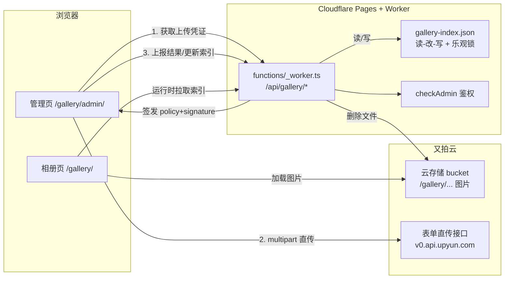

# 相册后台管理方案（Gallery Admin）

> 目标：在现有相册页基础上新增一个**管理页** `/gallery/admin/`，支持相册创建、图片上传、预览、删除等管理功能。
> 决策方式：与用户逐项确认（grilling），已达成共享理解。

---

## 1. 背景与现状

- 博客为 **Astro 静态站**，部署到 **Cloudflare Pages**（GitHub Actions push master 触发 `pnpm build` + `wrangler pages deploy`）。
- 相册图片存放在 `public/gallery/{相册ID}/`，构建时由 `src/utils/gallery-utils.ts` 的 `scanAlbumPhotos()` 扫描目录，生成相册列表（`src/pages/gallery/index.astro`）与相册详情（`src/pages/gallery/[album].astro`）。
- 相册元数据写死在 `src/config/galleryConfig.ts`（`albums[]`、`columnWidth`、`networkAlbum`）。
- 已有 Cloudflare Worker 路由体系：`functions/_worker.ts` 处理 `/api/ai-chat`、`/api/github-contributions`、`/api/poster-image`，并注入安全响应头。
- **目前没有任何管理员认证机制**；站点启用 Swup 局部刷新、Fancybox 灯箱、懒加载 PhotoCard，均可复用。

## 2. 目标

1. 管理页可**创建相册**（名称/描述/标签/日期/地点）。
2. 管理页可向相册**上传图片**（拖拽、多文件、进度反馈）。
3. 管理页可**预览**图片（Fancybox 灯箱）与**删除**图片。
4. 前台相册列表/详情页能**运行时合并展示动态相册**（管理页创建的相册），无需重新构建部署。
5. 风格与博客一致：黑白简约 + 玻璃卡片 + 暗色模式自适应。

## 3. 关键决策（已确认）

| 项 | 决策 |
|---|---|
| 存储 | **又拍云云存储（标准存储）**，国内访问快、免费额度友好 |
| 上传链路 | **浏览器直传**：Worker 签发 policy/signature，浏览器 multipart 直传又拍云 |
| 索引 | 又拍云上存 **`gallery-index.json`**，Worker 读-改-写 + 版本号乐观锁 |
| 鉴权 | **Bearer Token**：`GALLERY_ADMIN_TOKEN` 环境变量；`checkAdmin()` 抽象，预留 Cloudflare Access 升级路径 |
| 管理页路由 | 独立页面 **`/gallery/admin/`**（不走 Swup，独立 Svelte 应用） |
| 相册管理 | v1 即支持**动态创建相册**，写索引；同时保留静态相册（`galleryConfig.ts`） |
| 前台合并 | 列表页 = 构建时静态相册 + 运行时拉索引合并动态相册；详情页动态相册走客户端渲染，静态相册保持现有 Astro 静态路由 |
| 上传限制 | 单文件 ≤ 5MB；webp/jpg/png/gif |
| 文件命名 | `{相册ID}/{时间戳}-{随机4位}.{ext}` |
| 预览 | 复用 Fancybox 灯箱 |
| 删除 | 单张删除 + 自定义确认弹窗 |
| 风格 | 与博客同风格（黑白简约 + 玻璃卡片 + 暗色自适应） |
| 构建 | `pnpm check` / `pnpm type-check` 通过，CI 保持绿 |

## 4. 架构总览



### 4.1 静态相册与动态相册的区分

- **静态相册**：`galleryConfig.albums` 中定义，图片在 `public/gallery/{id}/`，构建期扫描。
- **动态相册**：管理页创建，元数据与图片均存于又拍云，运行时可增删。

## 5. 又拍云配置步骤（需用户手动完成）

1. 注册/登录又拍云控制台，完成实名认证。
2. 创建**云存储服务（Bucket）**，如 `my-blog`。
3. 获取**操作员**（Operator）名称与密码，用于签名与删除。
4. 开通**表单 API**（控制台 → 云存储 → 服务 → 功能配置 → 表单 API），获得表单 API 密钥。
5. 配置 **CORS**：允许你的站点域名（及本地开发 `http://localhost:4321`）发起跨域 multipart 直传。
6. （可选）开通云处理（缩略图/水印），v1 暂不使用，仅预留。

## 6. API 设计（`/api/gallery/*`）

所有接口均需 `Authorization: Bearer <GALLERY_ADMIN_TOKEN>`（除公开的读取接口）。

| 方法 | 路径 | 鉴权 | 说明 |
|---|---|---|---|
| GET | `/api/gallery/index` | 公开（只读） | 返回 `gallery-index.json` 内容（相册+图片列表） |
| POST | `/api/gallery/upload-token` | 管理 | 入参 `{albumId, filename, contentType}`，返回 `{policy, signature, uploadUrl, path}` |
| POST | `/api/gallery/complete` | 管理 | 上传成功后上报，更新索引（新图片条目） |
| POST | `/api/gallery/delete` | 管理 | 入参 `{albumId, path}`，删除图片 + 更新索引 |
| POST | `/api/gallery/album` | 管理 | 创建相册，入参 `{id, name, description?, date?, location?, tags?}` |
| DELETE | `/api/gallery/album/:id` | 管理 | 删除相册（含其中图片） |
| POST | `/api/gallery/album/:id/cover` | 管理 | 设置相册封面 |

### 6.1 上传凭证签发逻辑

1. 校验 token。
2. 校验相册存在（静态或动态）。
3. 生成 `path = {albumId}/{Date.now()}-{random4}.{ext}`。
4. 构造又拍云表单 API 的 `policy`（JSON 字符串，含 bucket、save-key、expiration、content-length-range、x-upyun-meta 等字段）。
5. `signature = MD5(policy + "&" + FORM_API_SECRET)`（纯 JS MD5，`js-md5` 或手写）。
6. 返回 `{ policy, signature, uploadUrl: "https://v0.api.upyun.com/<bucket>", path }`。

### 6.2 索引更新（乐观锁）

- `gallery-index.json` 结构（见 §7）。
- 更新流程：GET 索引 → 本地修改 → PUT 回写，携带版本号 `version`；若云端版本号与本地不符（`409`），重试（个人博客并发极低，重试 2-3 次即可）。

## 7. 数据模型（`gallery-index.json`）

```jsonc
{
  "version": 3,
  "albums": [
    {
      "id": "dynamic-album-2026",
      "name": "2026 旅行",
      "description": "夏天的记录",
      "date": "2026-08-01",
      "location": "大理",
      "tags": ["旅行", "夏天"],
      "cover": "/gallery/dynamic-album-2026/cover.webp",
      "dynamic": true,
      "createdAt": "2026-08-04T10:00:00Z",
      "photos": [
        { "path": "/gallery/dynamic-album-2026/1722750000-8f3a.webp", "size": 123456, "uploadedAt": "2026-08-04T10:05:00Z" }
      ]
    }
  ]
}
```

- `photos[].path` 即又拍云对象 key（不含 bucket），前台拼 `https://<bucket>.b0.upaiyun.com` + path 访问。
- 封面策略：`cover` 未设置时取 `photos[0].path`。

## 8. 前端页面设计

### 8.1 管理页 `/gallery/admin/`（独立 Svelte 应用）

- **布局**：顶部栏（返回相册 / 相册选择器 / 图片统计 / 退出登录）+ 主体卡片。
- **鉴权**：打开时若无 token，显示登录卡片（输入管理密码 → 存 sessionStorage）。
- **上传区**：大块拖拽区（虚线边框 + 拖入高亮 + 图标），支持点击多选；上传时逐张显示进度条与状态徽标（排队/上传中/成功/失败）。
- **相册创建**：表单（名称/描述/标签/日期/地点）→ POST 创建 → 刷新列表。
- **图片网格**：复用现有瀑布流/网格；悬停浮出操作层（预览 / 复制链接 / 删除），删除后卡片淡出移除。
- **预览**：Fancybox 灯箱（复用站点现有 fancybox 集成）。
- **Toast**：成功/失败/错误反馈。
- **确认弹窗**：自定义（比原生 confirm 美观，风格统一）。
- **动效**：复用站点 hover 过渡、入场淡入。

### 8.2 前台相册列表页改造（`src/pages/gallery/index.astro`）

- 构建时仍渲染静态相册（`galleryConfig.albums`）。
- 页面加载后 `fetch('/api/gallery/index')` 获取动态相册，**追加**渲染到网格（卡片样式复用 `AlbumCard`），可加"云端相册"分区或同一网格。
- 过滤标签需把动态相册的 tags 合并进 `allTags`。

### 8.3 前台相册详情页改造

- **静态相册**：保持现有 Astro 静态路由（`[album].astro`）。
- **动态相册**：`[album].astro` 在 `getStaticPaths` 找不到时，返回一个**客户端渲染壳**（Svelte 组件），运行时从索引读取相册元数据与图片渲染；或新建 `/gallery/dynamic/[id]/` 路由。

## 9. 安全设计

1. **鉴权**：`checkAdmin(request)` 校验 `Authorization: Bearer <GALLERY_ADMIN_TOKEN>`；环境变量缺失时管理接口返回 503（避免误配导致裸奔）。
2. **上传限制**：`content-length-range` 在 policy 中限制单文件 ≤ 5MB；Worker 侧校验文件类型白名单。
3. **路径安全**：`save-key` 由 Worker 生成，禁止用户自定义路径；相册 ID 校验（仅 `[a-z0-9-]`）。
4. **删除安全**：删除接口二次校验 token；删除图片后更新索引。
5. **升级路径**：鉴权集中在 `checkAdmin()`；将来启用 Cloudflare Access 时，把管理路径 `/gallery/admin/*` 与 `/api/gallery/*` 挂到 Access Application，Worker 代码几乎不用改。
6. **CSP 注意**：现有 `_worker.ts` 的 CSP 已允许 `img-src 'self' data: blob: https:`，又拍云图片外链可用；若需限制为又拍云域名可收紧。

## 10. 环境变量与 Secret 清单

| 变量 | 说明 | 位置 |
|---|---|---|
| `GALLERY_ADMIN_TOKEN` | 管理密码（Bearer Token） | Cloudflare Pages → Settings → Environment variables（Secret） |
| `UPYUN_BUCKET` | 又拍云服务名（Bucket） | 同上 |
| `UPYUN_OPERATOR` | 操作员名称 | 同上 |
| `UPYUN_OPERATOR_PASSWORD` | 操作员密码 | 同上 |
| `UPYUN_FORM_API_SECRET` | 表单 API 密钥 | 同上 |
| `UPYUN_CDN_HOST` | 又拍云 CDN 访问域名（如 `https://cdn.example.com` 或 `https://<bucket>.b0.upaiyun.com`） | 同上 |

> 本地开发：复制 `.env.example` 新增上述变量到 `.env`（注意 `.env` 已 gitignore，勿提交真实密钥）。

## 11. 实施步骤（分阶段）

### 阶段 1：后端（Worker + 又拍云集成）
1. `functions/_worker.ts` 新增 `/api/gallery/*` 路由。
2. 新增 `src/workers/cloudflare/gallery/`：`checkAdmin.ts`、`upyun.ts`（签名/删除/读写索引）、`handler.ts`。
3. 纯 JS MD5 工具（`js-md5` 依赖或手写），适配 Workers 环境。
4. 索引读写 + 乐观锁。

### 阶段 2：管理页前端
5. 新建 `src/pages/gallery/admin.astro`（独立布局，不走 Swup）。
6. 新建 `src/components/pages/gallery/admin/`：`LoginCard.svelte`、`UploadZone.svelte`、`AlbumForm.svelte`、`PhotoGrid.svelte`、`ConfirmDialog.svelte`、`Toast.svelte`。
7. i18n 文案（zh_CN / zh_TW / en / ja / ru）。

### 阶段 3：前台合并
8. 改造 `src/pages/gallery/index.astro`：运行时拉索引，合并动态相册。
9. 改造 `src/pages/gallery/[album].astro`：动态相册客户端渲染壳。

### 阶段 4：验证
10. `pnpm check` / `pnpm type-check` / `pnpm build` 通过。
11. 本地 `wrangler dev` 联调（需本地 `.env` 配置又拍云变量）。
12. 手动验证：创建相册 → 上传 → 预览 → 删除 → 前台可见。

## 12. 风险与注意事项

1. **又拍云表单 API 签名**：官方 SDK 面向 Node，Worker 需纯 JS MD5；签名逻辑短，风险可控。
2. **索引并发写**：乐观锁 + 重试；个人博客并发极低，可接受。
3. **又拍云免费额度**：联盟计划有绑定条件（挂 Logo 链接、每年续期）；若不想挂链接，用标准存储计费（约 0.129 元/GB/月）。
4. **CORS**：务必配置站点域名 + 本地开发域名，否则直传会失败。
5. **删除相册**：删除相册会删除其中所有图片（又拍云对象），需二次确认。
6. **Swup 兼容**：管理页不走 Swup；前台相册页合并逻辑需在 `astro:page-load` 后执行（Swup 局部刷新时会重新触发）。
7. **CSP**：`img-src` 已允许 https，但 `connect-src` 需确认允许又拍云 API 域名（`v0.api.upyun.com` 等）。
8. **本地开发**：`astro.config.mjs` 的 vite proxy `/api` → `localhost:8787`（wrangler dev），沿用即可。

## 13. 已确认配置（2026-08-04）

> 敏感值（操作员密码、表单密钥、管理 Token）**不写入本文档**，仅存于本地 `.env`（已 gitignore）与 Cloudflare Pages Secrets。

| 变量 | 值 | 敏感 |
|---|---|---|
| `UPYUN_BUCKET` | `img-hakugyokurou-fun` | 否 |
| `UPYUN_OPERATOR` | `uuz` | 否 |
| `UPYUN_OPERATOR_PASSWORD` | （本地 `.env`） | **是** |
| `UPYUN_FORM_API_SECRET` | （本地 `.env`） | **是** |
| `UPYUN_CDN_HOST` | `https://img.hakugyokurou.fun` | 否 |
| `GALLERY_ADMIN_TOKEN` | 待生成（用户自定义） | **是** |

## 14. 待用户提供的配置

- [ ] 又拍云账号实名认证
- [ ] 创建云存储服务（Bucket）名称
- [ ] 操作员名称/密码
- [ ] 表单 API 密钥
- [ ] CDN 访问域名
- [ ] CORS 配置确认
- [ ] Cloudflare Pages 环境变量（Secret）：`GALLERY_ADMIN_TOKEN`、`UPYUN_*`

## 15. 实现说明（2026-08-04，代码已完成并通过验证）

### 已实现文件

- 后端：`src/workers/cloudflare/gallery/`（`md5.ts` 纯 TS MD5、`upyun.ts` REST/表单集成、`handler.ts` 路由、`types.ts`）；`functions/_worker.ts` 接入 `/api/gallery/*` 与动态相册兜底；`worker-configuration.d.ts`、`.env.example` 补充环境变量。
- 管理页：`src/pages/gallery/admin.astro` + `src/components/pages/gallery/admin/`（`GalleryAdmin`、`LoginCard`、`AlbumForm`、`UploadZone`、`PhotoGrid`、`ConfirmDialog`、`types.ts`）+ `src/styles/pages/gallery-admin.css`。
- 前台合并：`DynamicAlbums.svelte`（列表页）、`DynamicPhotos.svelte`（详情页）、`DynamicAlbumViewer.svelte` + `/gallery/dynamic-album/` 客户端渲染壳。
- i18n：新增约 35 个键，覆盖 zh_CN / zh_TW / en / ja / ru。

### 与方案文档不同的实现细节（以实际代码为准）

1. **REST API 主机**：读写索引/删除文件使用 `https://v0.api.upyun.com/`（不是 `api.upyun.com`）。
2. **REST 认证**：又拍云现行认证为 `Authorization: UPYUN <operator>:<Base64(HMAC-SHA1(key=MD5(操作员密码), data=METHOD&URI&DATE[&Content-MD5]))>`；PUT 带 `Content-MD5`。
3. **429 并发写**：又拍云对同一 key 的连续写返回 `42900007 concurrent put or delete`，`writeIndex`/`deleteFile` 已加指数退避重试（300ms × 2^n，最多 5 次）。
4. **动态相册壳路由**：Astro 忽略下划线前缀页面文件，因此壳页为 `/gallery/dynamic-album/`（非 `_dynamic`）；`_worker.ts` 对构建时不存在的 `/gallery/{id}/` 请求用该壳页响应（URL 不变）。
5. **管理 Token**：已生成随机 32 位 hex 写入本地 `.env`（gitignored），**需同步配置到 Cloudflare Pages Secrets**。
6. **i18n 补充键**：`galleryAdminCancel`、`galleryAdminDone`。

### 验证结果

- `pnpm type-check` / `pnpm check`（astro check）：通过，0 错误。
- `pnpm build`：通过，38 个页面（含 `/gallery/admin/`、`/gallery/dynamic-album/`）。
- 又拍云真实 bucket 端到端 13/13 通过：索引读写、表单直传（multipart + policy/signature）、删除文件、鉴权（401/200）、创建/删除相册；测试数据已清理。
- Biome lint：新增文件 0 错误（本地 Windows 对两个 i18n 文件有 IO 误报，CI 为 Linux 不受影响）。

### 部署前用户操作清单

- [ ] Cloudflare Pages → Settings → Variables and Secrets 添加（Production + Preview）：`GALLERY_ADMIN_TOKEN`（见 `.env`）、`UPYUN_BUCKET`、`UPYUN_OPERATOR`、`UPYUN_OPERATOR_PASSWORD`、`UPYUN_FORM_API_SECRET`、`UPYUN_CDN_HOST`
- [ ] 又拍云控制台为该服务配置 CORS（允许站点域名 + `http://localhost:4321`）
- [ ] （可选）轮换对话中已暴露的操作员密码与表单密钥
- [ ] 部署后访问 `/gallery/admin/` 用 `GALLERY_ADMIN_TOKEN` 登录


